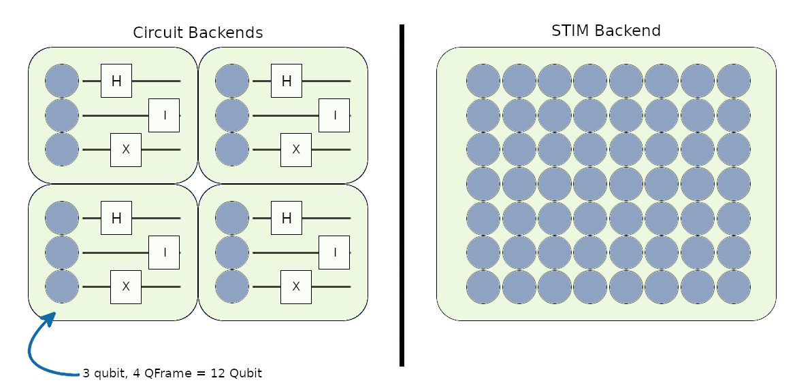

Quantum Operations
===============

QFrame vs Qubit
-----------------------------
Allocate qubit operations must be called differently according to different backends.
Since Cirq, Qiskit and Sdqs are circuit simulators, qubits allocated as circuit blocks.
STIM supports all invocation methods.

Allocate Qubit
-----------------------------

As expected from a quantum network simulator, QDNS can perform allocate qubit operations with different backends.
Allocate operation gets application unique qubit pointer from backend.
In the example below, Alice node is doing allocate operations::

    class Alice(QDNS.Node):
        def __init__(self):
            super().__init__("Alice")
            self.create_new_application(self.alice_default_app)

        @staticmethod
        def alice_default_app(default_app: QDNS.Application, *user_args):

            """
            allocate_qframe in below:
                Allocates 3 qubit circit in Cirq, Qiskit or Sdqs
                Allocates 3 qubit in Stim
            """
            qubits = default_app.allocate_qframe(3)
            print("Allocated 3x1 frame: ", qubits)

            """
            allocate_qframes in below:
                Allocates 3 qubit 3 circit in Cirq, Qiskit or Sdqs
                Allocates 9 qubit in Stim
            """
            qubit_frames = default_app.allocate_qframes(3, 3)
            print("Allocated 3x3 frame: ", qubit_frames)

            """
            allocate_qframe in below:
                Allocates 2 qutrit circuit in Cirq
                Allocates 2 qubit circit in Qiskit or Sdqs
                Allocates 2 qubit in Stim
            """
            qutrits = default_app.allocate_qframe(2, 3)
            print("Allocated qutrits: ", qutrits)

            """
            allocate_qubit in below:
                Allocates 1 qubit circit in Cirq, Qiskit or Sdqs
                Allocates 1 qubit in Stim
            """
            qubit = default_app.allocate_qubit()
            print("Allocated qubit: ", qubit)

            """
            allocate_qubits in below:
                Allocates 4 qubit circit in Cirq, Qiskit or Sdqs
                Allocates 4 qubit in Stim
            """
            qubits = default_app.allocate_qubits(4)
            print("Allocated qubit: ", qubits)

            print("Total allocated qubits in app: ", default_app.allocated_qubits)

.. code-block:: python

    Allocated 3x1 frame:  ['1020000000', '1020000001', '1020000002']
    Allocated 3x3 frame:  [['1020000100', '1020000101', '1020000102'],
                           ['1020000200', '1020000201', '1020000202'],
                           ['1020000300', '1020000301', '1020000302']]
    Allocated qutrits:  ['1030000000', '1030000001']
    Allocated qubit:  '1020000400'
    Allocated qubits:  ['1020000500', '1020000501', '1020000502', '1020000503', '1020000504']

    Total allocated qubits in app:
    [
        '1020000000', '1020000001', '1020000002', '1020000100', '1020000101',
        '1020000102', '1020000200', '1020000201', '1020000202', '1020000300',
        '1020000301', '1020000302', '1030000000', '1030000001', '1020000400',
        '1020000500', '1020000501', '1020000502', '1020000503', '1020000504'
    ]

``allocate_qframe(s) function works as allocate_qubit(s) on STIM.``

Deallocate Qubits
-----------------------------

In order to use the hardware resources more effectively, the qubits whose work is finished should be released.
The code below continues from previous sections::

    class Alice(QDNS.Node):
        def __init__(self):
            super().__init__("Alice")
            self.create_new_application(self.alice_default_app)

        @staticmethod
        def alice_default_app(default_app: QDNS.Application, *user_args):
            ...
            ...
            default_app.deallocate_qubits(*qubits)

Measure Qubits
-----------------------------

With this operation we can measure qubits. The code below continues from previous sections::

    class Alice(QDNS.Node):
        def __init__(self):
            super().__init__("Alice")
            self.create_new_application(self.alice_default_app)

        @staticmethod
        def alice_default_app(default_app: QDNS.Application, *user_args):
            ...
            ...

            # Lets measure all qubits allocated by this application.
            # True Flag = Do non-destructive measures.
            print("Results: ", default_app.measure_qubits(default_app.allocated_qubits, True))

.. code-block:: python

    Results:  [0. 0. 0. 0. 0. 0. 0. 0. 0. 0. 0. 0. 0. 0. 0.]

Gates
-----------------------------

QDNS contains various operators preapired for users::

    from QDNS import gates
    print("Gate Count: ", gates.predefined_gates.__len__())
    print("Gates: ", [gate.gate_name for gate in gates.predefined_gates])

.. code-block:: python

    Gate Count:  37
    Gates:  [
        'IDGate', 'RXGate', 'RYGate', 'RZ', 'PauliX', 'PauliY',
        'PauliZ', 'SGate', 'TGate', 'HGate', 'Psedo-HGate', 'CRXGate',
        'CXGate', 'CRYGate', 'CYGate', 'CRZGate', 'CYGate', 'CSGate',
        'CTGate', 'CHGate', 'IIGate', 'SWAPGate', 'iSWAPGate', 'XXGate',
        'YYGate', 'ZZGate', 'MSGate', 'MagicGate', 'CVGate', 'XYGate',
        'DCXGate', 'bSWAPGate', 'QFTGate', 'WGate', 'CCXGate', 'CSWAPGate', 'CCZGate'
    ]

Applying gates to qubits follows as::

    class Alice(QDNS.Node):
        def __init__(self):
            super().__init__("Alice")
            self.create_new_application(self.alice_default_app)

        @staticmethod
        def alice_default_app(default_app: QDNS.Application, *user_args):
            ...
            ...

            qubits = default_app.allocate_qframe(2)
            default_app.apply_transformation(gates.HGate(), qubits[0])
            default_app.apply_transformation(gates.CXGate(), qubits[0], qubits[1])
            print("Results: ", default_app.measure_qubits(qubits))

.. code-block:: python

    Results:  [1. 1.]

Reset
-----------------------------
QDNS allows users to reset qubits in every backend::

    class Alice(QDNS.Node):
        def __init__(self):
            super().__init__("Alice")
            self.create_new_application(self.alice_default_app)

        @staticmethod
        def alice_default_app(default_app: QDNS.Application, *user_args):
            ...
            ...

            # Lets reset epr qubits from top.
            default_app.reset_qubits(qubits)
            print("After Reset Result: ", default_app.measure_qubits(qubits))

.. code-block:: python

    Results:  [0. 0.]

Generating Pairs
-----------------------------
QDNS has built in epr and ghz pair generation process that faster than doing this manually::

    class Alice(QDNS.Node):
        def __init__(self):
            super().__init__("Alice")
            self.create_new_application(self.alice_default_app)

        @staticmethod
        def alice_default_app(default_app: QDNS.Application, *user_args):
            ...
            ...

            epr_frames = default_app.generate_entangle_pairs(10)
            ghz_frames = default_app.generate_ghz_pair(3, 10)

            print("EPR's: ", epr_frames)
            print("GHZ's: ", ghz_frames)

.. code-block:: python

    EPR's:  [
        ['1020012900', '1020012901'], ['1020013000', '1020013001'],
        ['1020013100', '1020013101'], ['1020013200', '1020013201'],
        ['1020013300', '1020013301'], ['1020013400', '1020013401'],
        ['1020013500', '1020013501'], ['1020013600', '1020013601'],
        ['1020013700', '1020013701'], ['1020013800', '1020013801']
    ]
    GHZ's:  [
    ['1020019600', '1020019601', '1020019602'], ['1020019700', '1020019701', '1020019702'],
    ['1020019800', '1020019801', '1020019802'], ['1020019900', '1020019901', '1020019902'],
    ['1020020000', '1020020001', '1020020002'], ['1020020100', '1020020101', '1020020102'],
    ['1020020200', '1020020201', '1020020202'], ['1020020300', '1020020301', '1020020302'],
    ['1020020400', '1020020401', '1020020402'], ['1020020500', '1020020501', '1020020502']
    ]

Full Test
-----------------------------
The following codes contain all the tests::

    import QDNS
    from QDNS import gates
    import logging

    class Alice(QDNS.Node):
        def __init__(self):
            super().__init__("Alice")
            self.create_new_application(self.alice_default_app)

        @staticmethod
        def alice_default_app(default_app: QDNS.Application, *user_args):

            """
            allocate_qframe in below:
                Allocates 3 qubit circit in Cirq, Qiskit or Sdqs
                Allocates 3 qubit in Stim
            """
            qubits = default_app.allocate_qframe(3)
            print("Allocated 3x1 frame: ", qubits)

            """
            allocate_qframes in below:
                Allocates 3 qubit 3 circit in Cirq, Qiskit or Sdqs
                Allocates 9 qubit in Stim
            """
            qubit_frames = default_app.allocate_qframes(3, 3)
            print("Allocated 3x3 frames: ", qubit_frames)

            """
            allocate_qframe in below:
                Allocates 2 qutrit circuit in Cirq
                Allocates 2 qubit circit in Qiskit or Sdqs
                Allocates 2 qubit in Stim
            """
            qutrits = default_app.allocate_qframe(2, 3)
            print("Allocated qutrits: ", qutrits)

            """
            allocate_qubit in below:
                Allocates 1 qubit circit in Cirq, Qiskit or Sdqs
                Allocates 1 qubit in Stim
            """
            qubit = default_app.allocate_qubit()
            print("Allocated qubit: ", qubit)

            """
            allocate_qubits in below:
                Allocates 4 qubit circit in Cirq, Qiskit or Sdqs
                Allocates 4 qubit in Stim
            """
            qubits = default_app.allocate_qubits(4)
            print("Allocated qubits: ", qubits)

            print("Total allocated qubits in app: ", default_app.allocated_qubits)

            # Deallocate some qubits
            default_app.deallocate_qubits(*qubits)

            # Lets measure all qubits allocated by this application
            print("Results: ", default_app.measure_qubits(default_app.allocated_qubits, True))

            # Lets create manually epr
            qubits = default_app.allocate_qframe(2)
            default_app.apply_transformation(gates.HGate(), qubits[0])
            default_app.apply_transformation(gates.CXGate(), qubits[0], qubits[1])
            print("Results: ", default_app.measure_qubits(qubits))

            # Lets reset epr qubits from top
            default_app.reset_qubits(qubits)
            print("After Reset Result: ", default_app.measure_qubits(qubits))

            # Lets generate epr and ghz auto
            epr_frames = default_app.generate_entangle_pairs(10)
            ghz_frames = default_app.generate_ghz_pair(3, 10)

            print("EPR's: ", epr_frames)
            print("GHZ's: ", ghz_frames)

    def main():
        logging.basicConfig(level=logging.WARNING)

        net = QDNS.Network()
        net.add_device(Alice())

        frames = {
            2: {
                1: 128,
                2: 128,
                3: 64,
                4: 32
            },

            3: {
                2: 16
            }

        }
        conf = QDNS.BackendConfiguration(QDNS.CIRQ_BACKEND, 5, frames)
        sim = QDNS.Simulator()
        sim.simulate(net, conf)

    if __name__ == '__main__':
        main()

.. code-block:: python

    WARNING:QDNS::Kernel::Backend:CIRQ backend is prepaired for simulation. Prepairation time: ~0.1609 sec
    Allocated 3x1 frame:  ['1020019200', '1020019201', '1020019202']
    Allocated 3x3 frames: [['1020019300', '1020019301', '1020019302'],
                           ['3020019200', '3020019201', '3020019202'],
                           ['2020019200', '2020019201', '2020019202']]

    Allocated qutrits:  ['1030000000', '1030000001']
    Allocated qubit:  1020000000
    Allocated qubits:  ['1020022400', '1020022401', '1020022402', '1020022403']

    Total allocated qubits in app:  ['1020019200', '1020019201', '1020019202', '1020019300',
                                     '1020019301', '1020019302', '3020019200', '3020019201',
                                     '3020019202', '2020019200', '2020019201', '2020019202',
                                     '1030000000', '1030000001', '1020000000', '1020022400',
                                     '1020022401', '1020022402', '1020022403']

    Results:  [0. 0. 0. 0. 0. 0. 0. 0. 0. 0. 0. 0. 0. 0. 0.]

    Results:  [1. 1.]

    After Reset Result:  [0. 0.]

    EPR's: [
             ['1020012900', '1020012901'], ['1020013000', '1020013001'],
             ['2020012800', '2020012801'], ['2020012900', '2020012901'],
             ['3020012800', '3020012801'], ['3020012900', '3020012901'],
             ['4020012800', '4020012801'], ['4020012900', '4020012901'],
             ['5020012800', '5020012801'], ['5020012900', '5020012901']
           ]
    GHZ's: [
             ['1020019400', '1020019401', '1020019402'], ['1020019500', '1020019501', '1020019502'],
             ['2020019300', '2020019301', '2020019302'], ['2020019400', '2020019401', '2020019402'],
             ['5020019200', '5020019201', '5020019202'], ['5020019300', '5020019301', '5020019302'],
             ['3020019300', '3020019301', '3020019302'], ['3020019400', '3020019401', '3020019402'],
             ['4020019200', '4020019201', '4020019202'], ['4020019300', '4020019301', '4020019302']
           ]

    WARNING:QDNS::Alice:Device simulation is idled after 1.0017 seconds.
    WARNING:QDNS::Kernel:Simulation is ended in 1.2541 seconds. Real raw time: 0.0485
