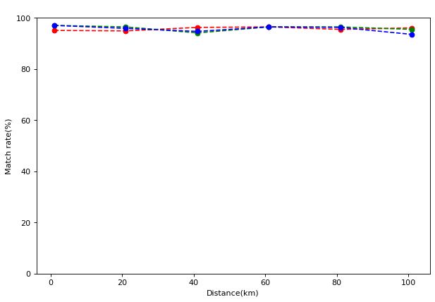
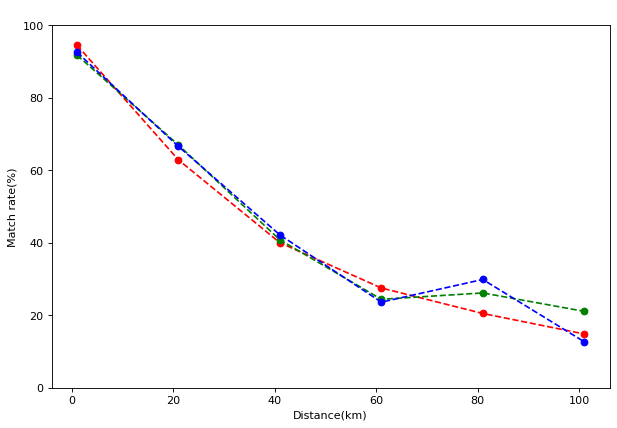
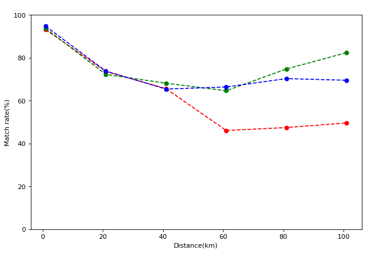

Noise Tests
===============

In this test, we will noise transparency among the backends::

    import QDNS
    import logging
    from matplotlib import pyplot as plt
    from matplotlib.pyplot import figure

We need to program Alice to send entangled pairs to Bob::

    class Alice(QDNS.Node):
        def __init__(self):
            super().__init__("Alice")
            self.create_new_application(self.alice_default_app)

        @staticmethod
        def alice_default_app(app: QDNS.Application):
            my_pairs = app.send_entangle_pairs(512, "Bob")

            if my_pairs is None:
                print("Sending pairs is failed.")
                return

            results = app.measure_qubits(my_pairs)
            app.put_simulation_result(results)

For Bob, we need to make him receiver of pairs::

    class Bob(QDNS.Node):
        def __init__(self):
            super().__init__("Bob")
            self.create_new_application(self.bob_default_app)

        @staticmethod
        def bob_default_app(app: QDNS.Application):
            op = app.wait_next_qubits(512)
            my_pairs, pair_length = op

            results = app.measure_qubits(my_pairs)
            app.put_simulation_result(results)

In the main function, we need to get backend, scrambling noise and lenght as paramater::

    def main(backend, length: float, channel):
        logging.basicConfig(level=logging.ERROR)

        # Build network
        alice, bob = Alice(), Bob()
        net = QDNS.Network(alice, bob)
        net.add_channels(alice, bob, length=length) #km

        # Set needed quantum resources.
        if backend == QDNS.STIM_BACKEND:
            frames = {2: 10000}
            core_count = 1
        else:
            core_count = int(QDNS.core_count / 2)
            frames = {
                2: {
                    1: 64,
                    2: 512
                }
            }

        # Create backend confuguration.
        backend_conf = QDNS.BackendConfiguration(backend, core_count, frames)

        # Create new noise with custom scramble channel.
        noise = QDNS.NoisePattern(
            0.02, 0.01, 0.005,
            scramble_channel=channel
        )

        # Simulate network.
        sim = QDNS.Simulator()
        results = sim.simulate(net, backend_conf, noise)

        # Get the user values.
        alice_results = results.user_dumpings(alice.label, QDNS.DEFAULT_APPLICATION_NAME)
        bob_results = results.user_dumpings(bob.label, QDNS.DEFAULT_APPLICATION_NAME)

        # Return error rate.
        count = 0
        for i in range(alice_results.__len__()):
            if alice_results[i] == bob_results[i]:
                count += 1
        return count / alice_results.__len__()

This stub in the below help us simulate multiple backends sequental::

    def stub(length: float, channel):
        errors = list()
        rate = main(QDNS.QISKIT_BACKEND, length, channel)
        errors.append(rate)
        rate = main(QDNS.CIRQ_BACKEND, length, channel)
        errors.append(rate)
        rate = main(QDNS.STIM_BACKEND, length, channel)
        errors.append(rate)
        return errors

    # Runs for 5 legth * 3 backend = 15 run
    def test(channel):
        error_rates = list()
        for i in range(1, 102, 20):
            error_rates.append([i, stub(i, channel)])
        return error_rates

First try with no noise channel::

    # Simulate with no noise between Alice and Bob fibre cable.
    lengths = list()
    plot_cirq = list()
    plot_qiskit = list()
    plot_stim = list()

    for errors in test(QDNS.no_noise_channel):
        length, rates = errors
        qiskit, cirq, stim = rates
        lengths.append(length)
        plot_cirq.append(cirq * 100)
        plot_qiskit.append(qiskit * 100)
        plot_stim.append(stim * 100)

    figure(figsize=(9, 6), dpi=80)
    plt.title("Leght scramble channel = no_noise")
    plt.plot(lengths, plot_cirq, 'ro--')
    plt.plot(lengths, plot_qiskit, 'go--')
    plt.plot(lengths, plot_stim, 'bo--')
    plt.ylim(0, 100)
    plt.xlabel("Distance(km)")
    plt.ylabel("Match rate(%)")
    plt.show()

The second try is with bit flip channel::

    # Simulate with bit flip between Alice and Bob fibre cable.
    lengths = list()
    plot_cirq = list()
    plot_qiskit = list()
    plot_stim = list()

    for errors in test(QDNS.bit_flip_channel):
        length, rates = errors
        qiskit, cirq, stim = rates
        lengths.append(length)
        plot_cirq.append(cirq * 100)
        plot_qiskit.append(qiskit * 100)
        plot_stim.append(stim * 100)

    figure(figsize=(9, 6), dpi=80)
    plt.title("Leght scramble channel = bit_flip")
    plt.plot(lengths, plot_cirq, 'ro--')
    plt.plot(lengths, plot_qiskit, 'go--')
    plt.plot(lengths, plot_stim, 'bo--')
    plt.ylim(0, 100)
    plt.xlabel("Distance(km)")
    plt.ylabel("Match rate(%)")
    plt.show()

The last test is with deporasitaion channel::

    # Simulate with depolarisation between Alice and Bob fibre cable.
    lengths = list()
    plot_cirq = list()
    plot_qiskit = list()
    plot_stim = list()

    for errors in test(QDNS.depolarisation_channel):
        length, rates = errors
        qiskit, cirq, stim = rates
        lengths.append(length)
        plot_cirq.append(cirq * 100)
        plot_qiskit.append(qiskit * 100)
        plot_stim.append(stim * 100)

    figure(figsize=(9, 6), dpi=80)
    plt.title("Leght scramble channel = depolarisation")
    plt.plot(lengths, plot_cirq, 'ro--')
    plt.plot(lengths, plot_qiskit, 'go--')
    plt.plot(lengths, plot_stim, 'bo--')
    plt.ylim(0, 100)
    plt.xlabel("Distance(km)")
    plt.ylabel("Match rate(%)")
    plt.show()

