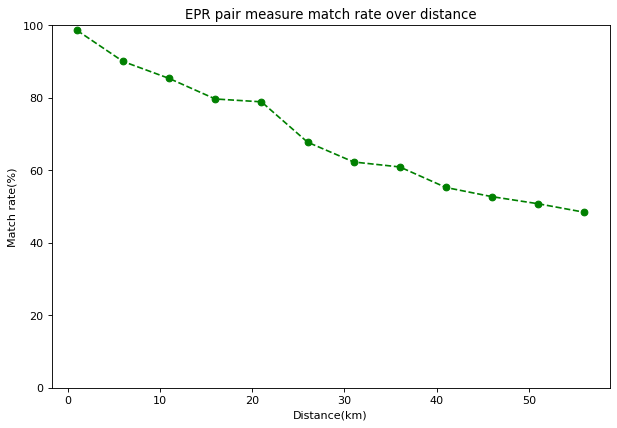

Bell Pair Example
===============

In this example, we generate bell pairs and send one qubit of pairs to Bob.
Then, Alice and Bob measures these qubits and put results to simulation results.
Then we calculate match rate over various connection distances.
First we need to import needed modules::

    import QDNS
    import logging
    from matplotlib import pyplot as plt
    from matplotlib.pyplot import figure

Now we need to create Alice node and program node to send entangle pairs to Bob::

    class Alice(QDNS.Node):
    def __init__(self):
        super().__init__("Alice")
        self.create_new_application(self.alice_default_app)

    @staticmethod
    def alice_default_app(app: QDNS.Application):
        my_pairs = app.send_entangle_pairs(512, "Bob")

        if my_pairs is None:
            print("Something gone wrong on Alice side.")
            return

        result = app.measure_qubits(my_pairs)
        app.put_simulation_result(result)

Also we need to program Bob::

    class Bob(QDNS.Node):
        def __init__(self):
            super().__init__("Bob")
            self.create_new_application(self.bob_default_app)

        @staticmethod
        def bob_default_app(app: QDNS.Application):
            op = app.wait_next_qubits(512)

            if op is None:
                print("Bob did not receive qubits.")
                return

            my_pairs, count = op[0], op[1]

            result = app.measure_qubits(my_pairs)
            app.put_simulation_result(result)

Now we need a main function::

    def main(length_):
        logging.basicConfig(level=logging.WARNING)

        alice, bob = Alice(), Bob()
        net = QDNS.Network(alice, bob)
        net.add_channels(alice, bob, length=length_) #km

        # Create configuration, we need 512x2 frames.
        core_count = int(QDNS.core_count/2)
        frames = {
            2: {
                2: int(600 / core_count)
            }
        }
        backend_conf = QDNS.BackendConfiguration(QDNS.CIRQ_BACKEND, core_count, frames)

        # Lets set all noises to 0 except channel error.
        # So we can measure impact of channel length more accurate.
        my_noise = QDNS.NoisePattern(
            0, 0, 0,
            sp_channel=QDNS.depolarisation_channel,
            measure_channel=QDNS.bit_and_phase_flip_channel,
            gate_channel=QDNS.phase_flip_channel,
            scramble_channel=QDNS.depolarisation_channel,
        )
        sim = QDNS.Simulator()
        results = sim.simulate(net, backend_conf, my_noise)

        # Grap results from Alice and Bob.
        alice_res = results.user_dumpings(alice.label, QDNS.DEFAULT_APPLICATION_NAME)
        bob_res = results.user_dumpings(bob.label, QDNS.DEFAULT_APPLICATION_NAME)

        Check match.
        count = 0
        for i in range(alice_res.__len__()):
            if alice_res[i] == bob_res[i]:
                count += 1
        rate = count / alice_res.__len__() * 100
        return rate

Lets loop main() function in different lengths::

    def run_more():
        results = list()
        lengths = list()
        for i in range(1, 61, 5):
            lengths.append(i)
            rate = main(i)
            results.append(rate)
        return lengths, results

Now we need to plot data::

    if __name__ == '__main__':
        plot_x, plot_y = run_more()
        figure(figsize=(9, 6), dpi=80)
        plt.title("EPR pair measure match rate over distance")
        plt.plot(plot_x, plot_y, 'go--')
        plt.ylim(0, 100)
        plt.xlabel("Distance(km)")
        plt.ylabel("Match rate(%)")

